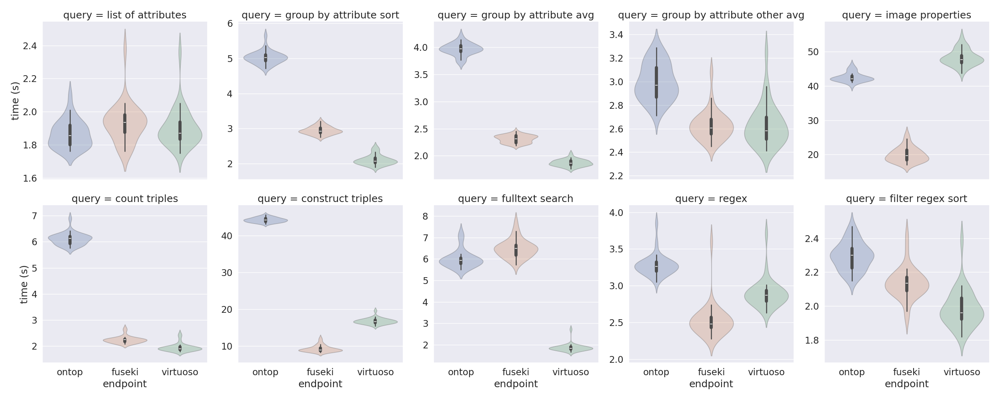
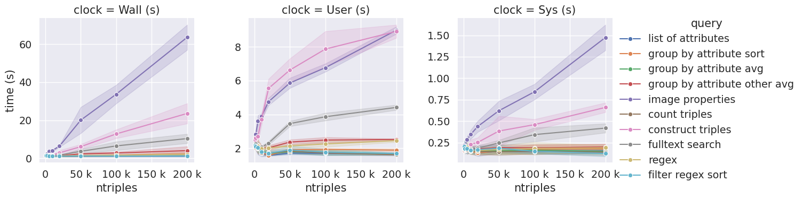
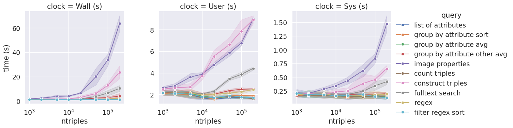

# Abstract
# Introduction

## Goals
### Goal 1:

### Goal 2:

### Goal 3: Endpoint Drafting and Testing ###

Our 3rd goal was to measure the performance of different SPARQL endpoint and
triplestore solutions. These data are needed to identify suitable software
solutions for exposing a knowledge graph that was derived from a OMERO instance as a
public web resource. We measured the query response time (QRT) of three endpoint implementations
by running a series of 10 SPARQL queries multiple times and on graphs of varying size. The methodology and results are presented below.

#### Motivation ####
Making RDF data publically accessible is typically achieved by running a web
server that accepts SPARQL queries via the http protocol and returns the query
results. Such a SPARQL endpoint often features an online query form to enter the
bespoke query and to visualize the results in an html table. Well known examples
are the Wikidata service at
[http://sparql.wikidata.org](http://sparql.wikidata.org) or the Uniprot endpoint
at [https://sparql.uniprot.org](https://sparql.uniprot.org). 

#### Triplestores and endpoints
Numerous opensource and commercial software
packages implementing this architecture exist, examples are
[Virtuoso](https://www.openlinksw.com/) , [Apache
Jena-Fuseki](https://jena.apache.org/documentation/fuseki2/) package,
[GraphDB](https://graphdb.ontotext.com/),
[qLever](https://github.com/ad-freiburg/QLever) [@Bast2017], [Blazegraph](https://blazegraph.com),
[Anzograph](https://docs.cambridgesemantics.com/anzograph), [Allegrograph](https://allegrograph.com), and [Stardog](https://www.stardog.com). Whereas these examples store the RDF data in a dedicated
semantic database (triplestore), other solutions connect to a relational database (RDB) in a process
called Virtualization. Virtualization maps the tabular structure of the RDB to a RDF graph by virtue
of R2RML mappings, a w3c standard. Examples listed in the [R2RML implementation report](https://rml.io/r2rml-implementation-report) are [Ontop-VKG](https://ontop-vkg.org),
[R2RML-F](https://github.com/chrdebru/r2rml), [Morph-RDB](https://morph.oeg.fi.upm.es/tool/morph-rdb), [Db2triples](https://github.com/antidot/db2triples), [Morph-KGC](https://morph.oeg.fi.upm.es/tool/morph-kgc), or [RMLMapper](https://github.com/rmlio/rmlmapper-java). 

#### Knowledge graph construction for OMERO: Materialization vs. Virtualization
In the context of exposing OMERO metadata through a SPARQL endpoint, we have to
consider two approaches of knowledge graph construction, materialization and
virtualization. Materialization means we first convert the OMERO metadata,
stored in a relational database into a static RDF graph, e.g.
using the software `omero-rdf` ([https://github.com/German-BioImaging/omero-rdf](https://github.com/German-BioImaging/omero-rdf). The generated RDF file would then be uploaded to the 
triplestore.  In contrast, virtualization avoids the step
of generating a RDF graph as an intermediate artifact and instead maps the relational
database "live" to a RDF representation. In other words, Virtualization keeps all data in
its original place, no duplication takes place. On the other hand, it must be expected that
 the additional steps of mapping incoming SPARQL queries to SQL (the query language for relational databases) and rewriting the SQL response into RDF makes a virtual KG less performant than a materialized KG that operates directly on graph data. The purpose of this study is hence to compare a virtual KG to a materialized KG in terms of query response time as a metric for overall performance.

#### Previous work on triplestore/sparql endpoint testing ####
Previously, materialized KG implementations, their triplestore loading time and query response time
were examined in a [blog post by Angus Addlesee](https://medium.com/wallscope/comparing-linked-data-triplestores-ebfac8c3ad4f). The study included 8 materialized KG implementations: Blazegraph, Stardog, Virtuoso, GraphDB, AnzoGraph, AllegroGraph, MarkLogic, and Apache Rya, but no virtual KG. In our study, we include Apache Jena Fuseki and Virtuoso as materialized KGs and Ontop as a virtual KG. Because RDF loading time is irrelevant for a VKG, we omitted this metric from our assessments.

#### Benchmark procedure ####
To measure the query response time, we executed the SPARQL query client utility `rsparql`, part
of the Apache-Jena software package (version 5.2.0, available at [https://archive.apache.org/dist/jena/binaries/](https://archive.apache.org/dist/jena/binaries/)), wrapped in the `time` command line tool:
```console
time rsparql --service ENDPOINT_URL --query QUERY_TEXT_FILE
```

`rsparql` submits the query contained in `QUERY_TEXT_FILE` IN SPARQL syntax via a http `GET`
request to SPARQL endpoint at `ENDPOINT_URL` and writes the response in a tabular format to the terminal output.`time` measures the time it takes to complete this process and returns
the elapsed time (wall time), user time (CPU clock cycles spent in the
`rsparql` code including libraries) and system time (CPU clock cycles spent in system code while running `rsparql`). On shared-memory hyperthreaded CPU architectures, wall time can be larger or smaller
than the sum of user and system time divided by the number of CPUs, depending on how CPUs are 
allocation to the measure process (`rsparql`) and other processes running at the same time.

We developed ten queries for our study, their characteristics are summarized in the following table

Table 1: Queries used in this study. 
| #  | Query filename                     | Query keywords                |
|:---|:-----------------------------------|:------------------------------|
| 0  | 00-construct_triples.rq            | CONSTRUCT, SELECT             |
| 1  | 01-list_of_attributes.rq           | SELECT                        |
| 2  | 02-group_by_attribute_sort.rq      | SELECT, GROUP BY, ORDER       |
| 3  | 03-group_by_attribute_avg.rq       | SELECT, GROUP BY, AGGREGATION |
| 4  | 04-regex.rq                        | SELECT, FILTER, REGEX         |
| 5  | 05-group_by_attribute_other_avg.rq | SELECT, GROUP BY, AGGREGATION |
| 6  | 06-count_triples.rq                | SELECT, COUNT                 |
| 7  | 07-filter_regex_sort.rq            | SELECT, FILTER, REGEX, SORT   |
| 8  | 08-image_properties.rq             | SELECT                        |
| 10 | 10-fulltext_search.rq              | SELECT, FILTER, CONTAINS      |


The timing runs performed in the following way (pseudocode)

```
for endpoint in [ONTOP, FUSEKI, VIRTUOSO]:
    for repeat in 1..N:
        for query in QUERY_FILENAMES:
            time rsparql --service endpoint --query query >> results_table
        endfor
    endfor
endfor
```

Iterating over endpoints, queries and repeats in this order mitigates potential impact of
server site caching on the timing results.


#### Test environment ####
All timing runs were performed on a Dell Precision 7820 workstation (24 hyperthreaded Intel Xeon Gold 5811 CPUs at 3.2 GHz maximum clock rate, 64 GB RAM).
The SPARQL endpoints and triplestores were running
on a virtual machine with XX CPUs and YY GB RAM provided by the University of Münster. The same VM also served the OMERO database (postgresql v. 17.??), OMERO server (version 5.6.?), and OMERO web (5.6.? )components. Initially, the client connected to the servers via VPN, and later switched over to the public internet.

The OMERO database was populated with 29088 tif images. These images were obtained from a public
dataset supplementing Ref.[:Shah2022]. The dataset was structured into one OMERO Project and 21 Datasets. Project and Dataset were annotated with name and description, all images were annotated with 15 key-value pairs. The resulting RDF graph had 503605 triples. 

All queries, shell scripts for timing, the RDF graph, timing results and data analysis are made
available at [omero-kg-benchmark](https://github.com/NFDI4BIOIMAGE/omero-kg-benchmark) repository.

##### TODO: Connect repo to zenodo and mint DOI

#### Results
##### Query response time for 10 different queries



Figure 1: Query response time (wall time) for 10 different queries (Table 1) run on 3 different SPARQL endpoints. 30 repetitions of each query give rise to the distributions shown as violin plots. Black boxes represent quartiles, whiskers represent the 95% high density interval of the distributions. The white bar marks the median.

Figure 1 summarizes the results from our benchmark evaluation
of the ten queries listed Table 1 run on each of the 3 endpoints.
The color coded violin plots mark the distribution of 30 individual timings. Shown here are only
the elapsed times (wall time). In most cases, there is a clear distinction between the materialized
knowledge graphs Fuseki and Virtuoso and the virtual knowledge graph Ontop with the latter being significantly slower to complete the request than the former. Relative differences of up to a factor 5 ("construct triples" query) are observed. Exceptions are the simplest query ("list of attributes"), where all endpoints are equally fast on average, the "fulltext search" query, where Ontop and Fuseki are both about 3 times slower than virtuoso and the "image properties" query, where both Ontop and Virtuoso are about 2-3 times slower than Fuseki. Overall this result affirms our
expectation that Ontop performs markedly worse due to the overhead of query and response translation between SPARQL and SQL. The finer differences in timings and why in some cases on of the materialized knowledge graphs performs worse than Ontop remain to be investigated.

##### Query response time as function of graph size



Figure 2: Wall time, user time, and system time as function of RDF graph size and measured for the ten queries in Table 1 run on the Fuseki endpoint. The upper row shows the data on linear x axis, the lower row show the same data but on a logarithmic x axis. Shaded areas represent the response time
distributions from 10 independent runs, dots mark the means, solid lines are to guide the eye.

Figure 2 shows the three times reported by `time`, elapsed (wall) time, user time, and system time
plotted against the respective graph size. Graphs of a defined size were generated by serializing the bespoke number of triples from the virtual knowledge graph in the Ontop endpoint and uploading to Fuseki. We only studied Fuseki in this exercise. All 10 queries were run 10 times, the respective timing distributions for each query are represented by shaded areas in Figure 2, the solid dots mark
the mean, solid lines are added to guide the eye. 

In all queries, we observe a similar pattern: For very small graphs, the queries all complete in about
1 second. We assume this limit comes from the network bandwith and other factors not related to the nature of the query or the endpoint implementation. As the graphs grow bigger, the query response time first curve first remains flat for a given query. At a certain size, the curve than starts to grow approximately linearly with graph size. This "point of departure" from the flat curve is
different for the various types of query. Some start linear growth very late, almost not noticable for the graph sizes studied here; others start growing linearly already at intermediate graph sizes of
before it starts to grow at increased slope, following roughly a linear 
# Achievements

# Discussion

# Summary and Conclusions

# Outlook

# Funding

**NFDI4BIOIMAGE** is funded by DFG grant number NFDI 46/1, project number
501864659.
**CCE\_DART** has received funding from the European Union’s Horizon 2020
research and innovation programme under grant agreement No 965397.

# References
